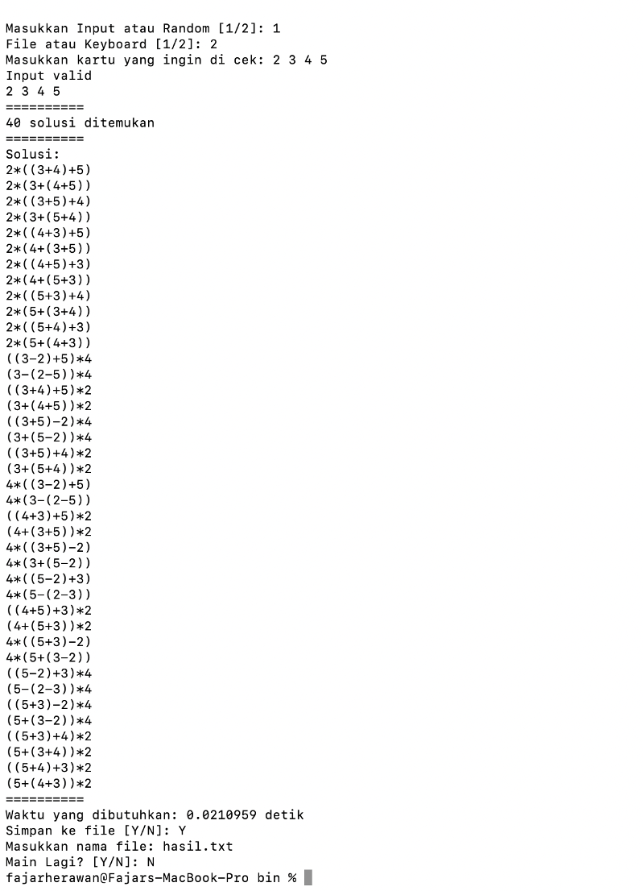
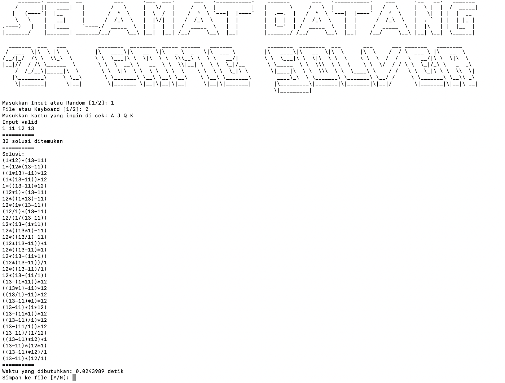
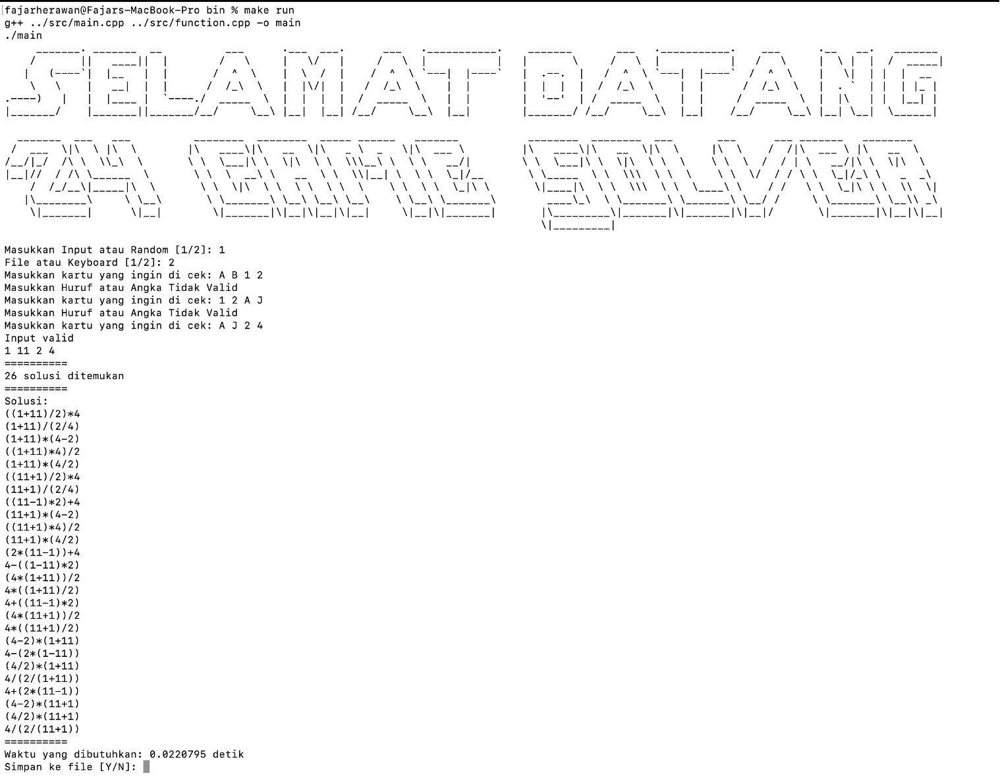
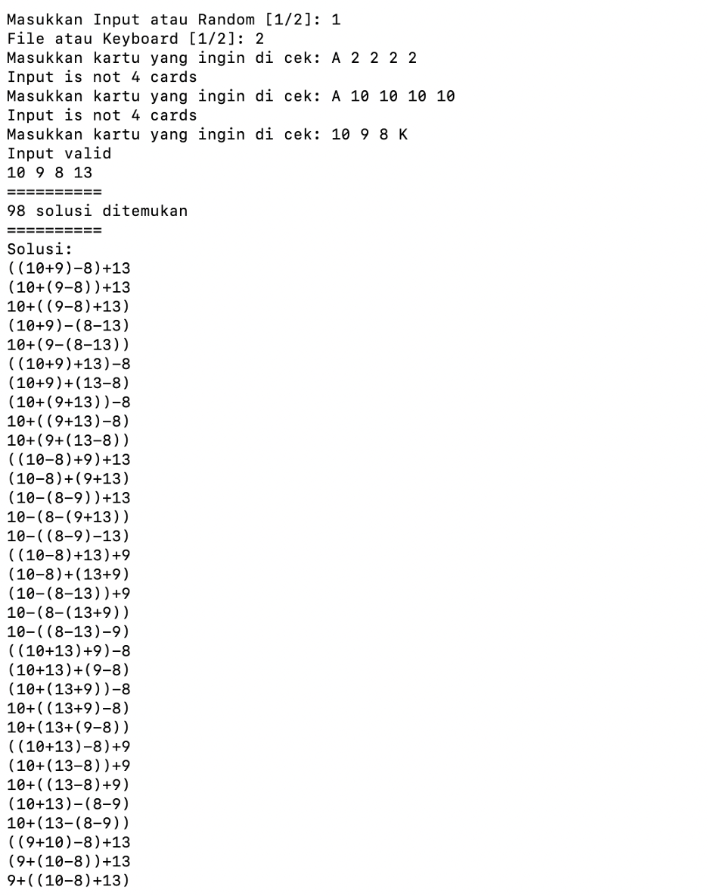
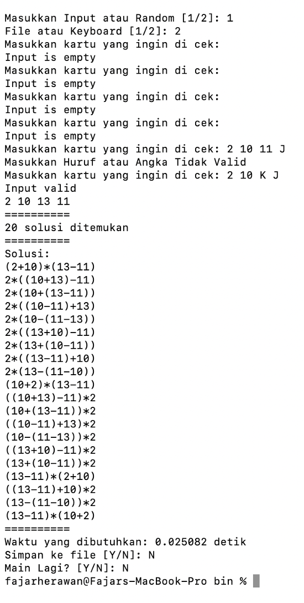
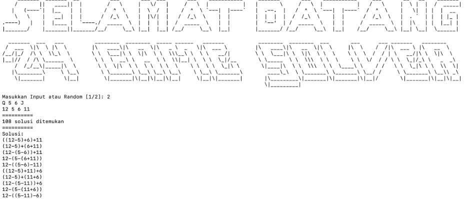
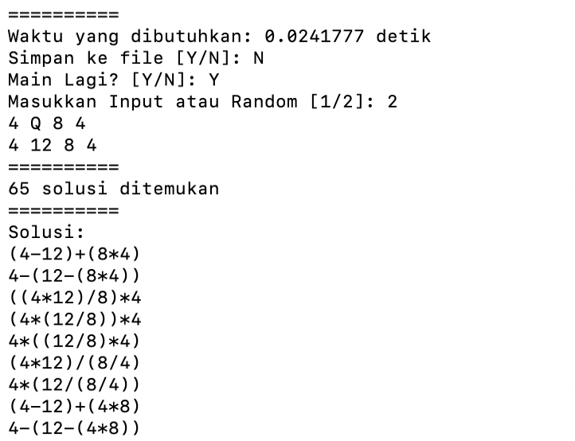
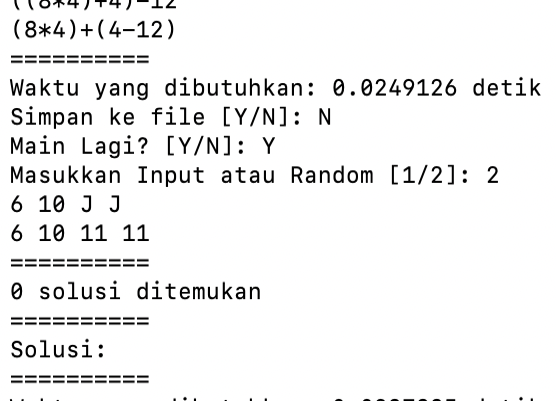
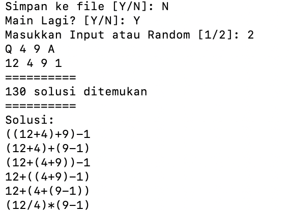
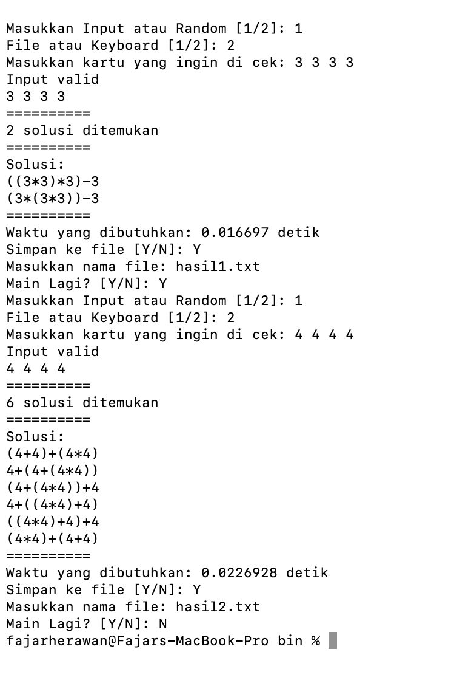

  # Tucil1_13521080
> Twenty Four Game Cars Solver using Brute force Algorithm.

## Table of Contents
* [General Info](#general-information)
* [Technologies Used](#technologies-used)
* [Features](#features)
* [Screenshots](#screenshots)
* [Usage](#usage)
* [Acknowledgements](#acknowledgements)
* [Author](#Author)
<!-- * [License](#license) -->

## General Information
Twenty four game card is a game that uses poker cards to guess how a combination of mathematics operation can make a 24. Player just take 4 cards and try to guess it. Brute Force Algorithm produces all of the combination of mathematics operation that require 24.
<!-- You don't have to answer all the questions - just the ones relevant to your project. -->

## Technologies Used
- std.lib
- sstream
- cstdlib
- vector
- iostream
- fstream
- string
- ctime

## Features
- Input file and user
- Random input
- Save file
- Show all the possibility that have a result 24

## Screenshots
1.	Input Pengguna Keyboard (Angka Semua)
  
2. Input Pengguna Keyboard (Huruf Semua)
  
3. Validasi Karakter
  
4. Validasi Jumlah
  
5. Validasi Input Kosong
  
6. Random Input
  
  
  
7. Save File
  
  

<!-- If you have screenshots you'd like to share, include them here. -->
## Usage

1. Git clone or download zip file 
2. Open Folder
3. `cd bin`
4. `make run`

## Acknowledgements
Give credit here.
- This Projects is intended to fulfill one of the assignments of the IF2211 Algorithmic Strategy  Course in Semester II of the 2022/2023 Academic Year
- Many thanks to all lab asisstant
- Many thanks to all algorithmic strategy lecturer

## Author
This Project was created by Fajar Maulana H / 13521080

<!-- Optional -->
<!-- ## License -->
<!-- This project is open source and available under the [... License](). -->

<!-- You don't have to include all sections - just the one's relevant to your project -->
